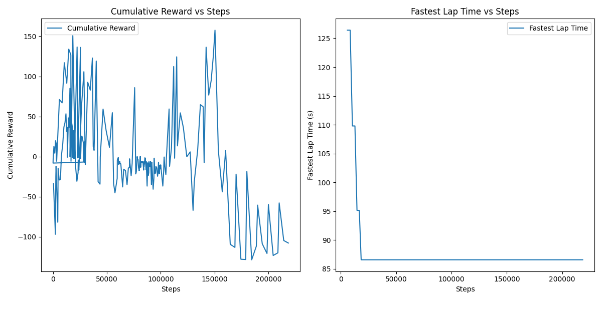
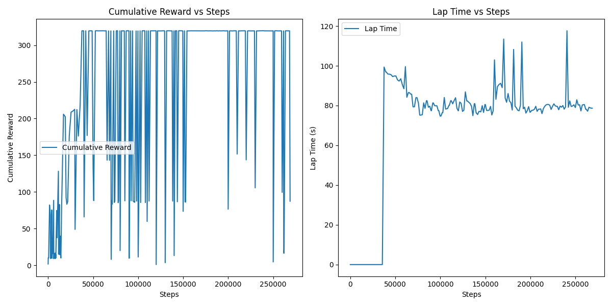

# Setup Guide

Here are the steps to setup a virtual environment with the necessary dependencies for running the project.
This guide assumes you have already followed the installation instructions of the [TMRL repository](https://github.com/trackmania-rl/tmrl/blob/master/readme/Install.md)

## Prerequisites

Make sure you have the following installed on your system:
- **Python 3.12.3** (other versions might work, but not tested)
- **pip** (package installer for Python)

## Setup Steps

### 1. Clone the Repository
Clone the project repository to your local machine:
```bash
git clone https://github.com/EmilJohns1/trackmania-sac-vs-ppo.git
cd trackmania-sac-vs-ppo
```

### 2. Create a Virtual Environment
Create a virtual environment in the `.venv` directory:
```bash
python -m venv .venv
```

### 3. Activate the Virtual Environment
Run the `activate` script of your virtual environment:
- **Windows**:
  ```bash
  .venv\Scripts\activate
  ```
- **Linux/macOS**:
  ```bash
  source .venv/bin/activate
  ```

### 4. Install Dependencies
Install the required Python packages listed in the `requirements.txt` file:
```bash
pip install -r requirements.txt
```

### 5. Run Project
You should now be able to run the agent of your choice:
- **PPO Agent**:
  ```bash
  python main.py --agent ppo
  ```
- **SAC Agent**:
  ```bash
  python main.py --agent sac
  ```

---

# SAC progress

Initially, after creating the SAC (Soft Actor-Critic) agent, we noticed it wasn’t learning effectively. We concluded that our model either wasn’t complex enough or didn’t have the computational power to train on the TM20Full environment, which has a high-dimensional observation space consisting of speed, gear, RPM, and four 64 x 64 images. This led us to switch to the TM20Lidar environment, which instead provides 4 x 19 Lidar beams. With this reduced observation space, we could process the inputs using a Multilayer Perceptron (MLP) for the Actor and Critics.

After switching to this environment, we observed an improvement in learning, though the agent still wasn’t performing at the level we expected. We then experimented with various hyperparameters:
- **Alpha**: Reduced from 0.20 to 0.10
- **Target Entropy**: Adjusted from -3.0 to -1.5
- **Gradient Norm Clipping**: Decreased from 1.0 to 0.5
- **Constant Time Penalty**: Reduced from 1.0 to 0.1

Additionally, we revised our reward system. We introduced harsher penalties for colliding with or driving close to walls, as the agent had a tendency to drive alongside the walls. We also implemented a penalty for excessive steering. With these changes, we noticed a significant improvement in the agent’s performance, as shown in the video below:

[](https://www.youtube.com/watch?v=H-gu15B3E9Y)

However, over time, the agent’s performance began to degrade. We hypothesized that this was due to the excessive penalty for colliding with walls combined with an insufficient constant time penalty. This caused the agent to drive very slowly to avoid wall collisions, which is illustrated in the video and graph below:


[](https://www.youtube.com/watch?v=WVIzBIZRctk)

To address this, we adjusted the reward system again. We increased the constant time penalty from 0.1 to 0.2 and decreased the collision penalty from -10 to -8. We also increased the penalty for excessive steering from -0.5 to -1.0 to prevent the agent from steering erratically, as observed in earlier runs.

These adjustments aim to balance speed and safety, enabling the agent to drive more effectively within the constraints of the environment.

We then realized that these custom rewards were only hindering the agent's learning as it worked best with the default reward system.

After this, we experimented with different hyperparameters, and found that the ones provided in the tmrl config worked best, the graph with these parameters can be seen below.



We can see that the agent reaches a plateau after around 75 000 steps, where it reaches an 'optimal' driving style and doesnt improve much after this.

A video of a complete lap done by the trained SAC agent can be seen below:

[](https://www.youtube.com/watch?v=D21icJWTuX8)